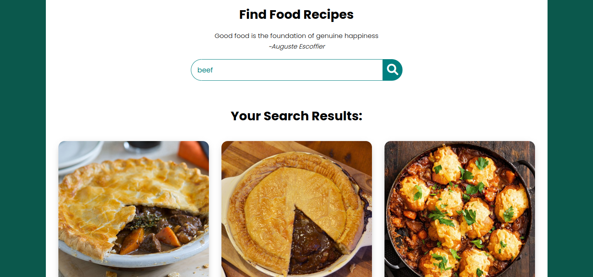

# Food-recipes
*By Otuya Nyangayi

# Table of Contents
 * Overview
 * Built With
 * Features
 * Contact
 * Acknowledgements

 # Overview 
 
This is a simple project which will allow users to search for a meal and get the recipe back.
It will use data from an external public API.
The projects live link: https://otuyanyangayi.github.io/Food-recipes/
 

 
 # Built With
 This project has been built with 
 * JAVASCRIPT
 * CSS
 * HTML
 * API link: https://www.themealdb.com/api.php
 
 # Features 
 
 Landing page 
 
 
 
 # Contact 
 
 
 # Acknowledgements 
@moringaschool
* themealdb 
